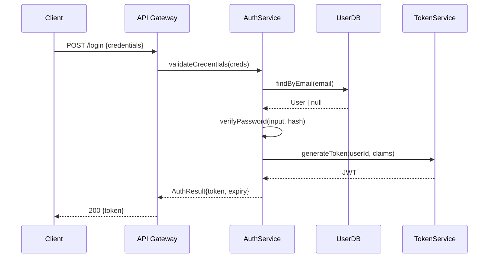
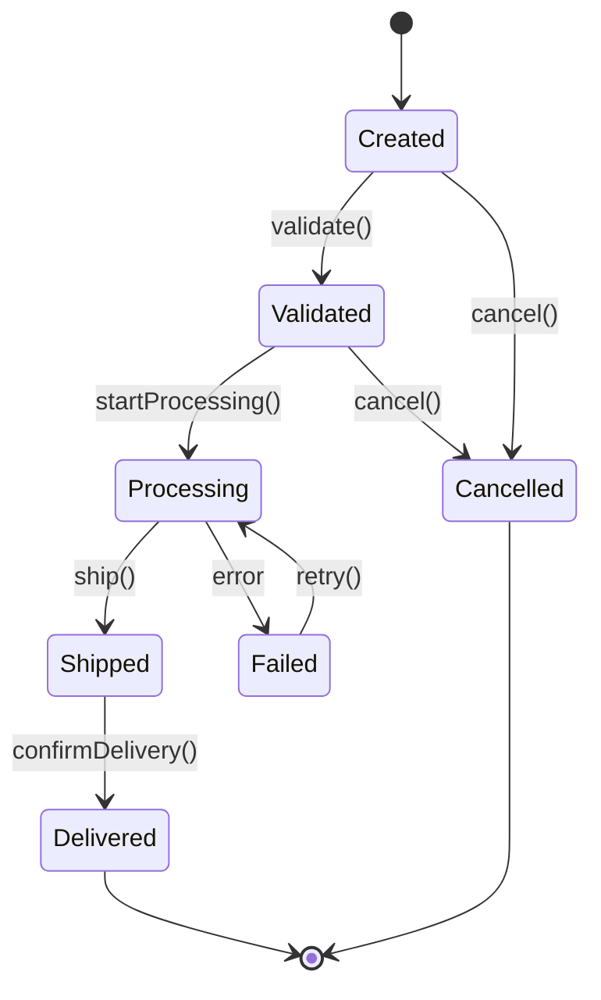
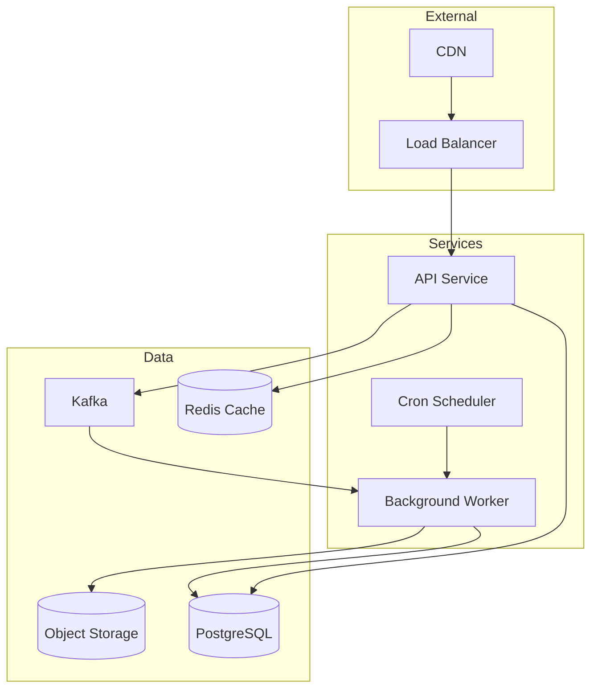

# CLAUDE.md — Source Code Reverse Engineering & Design Analysis

## Purpose

This file guides Claude agents in systematically reverse engineering software systems, extracting design patterns, understanding component coupling, and producing dense, accurate documentation suitable for humans and downstream agents.

---

## Core Principles

1. **Describe before critiquing** — Always fully articulate how something works before noting flaws
2. **Incremental discovery** — Analyze piece-by-piece to manage context; never try to load everything at once
3. **Dense summaries** — Produce highly compressed behavioral descriptions optimized for agent consumption
4. **Language agnostic** — Treat polyglot systems as unified wholes; coupling matters more than syntax
5. **Sub-agent delegation** — Spawn focused sub-tasks for deep dives; synthesize results at higher levels

---

## Phase 1: Reconnaissance

### 1.1 Directory Structure Survey

```bash
# First pass: understand project shape
find . -type f -name "*.md" -o -name "*.txt" -o -name "Makefile" -o -name "*.toml" -o -name "*.json" -o -name "*.yaml" | head -50
tree -L 3 -I 'node_modules|venv|__pycache__|.git|target|build|dist'
```

**Capture:**
- Build systems (Makefile, CMake, Cargo.toml, package.json, pyproject.toml, go.mod)
- Entry points (main.*, index.*, app.*, cmd/)
- Configuration (config/, *.yaml, *.env)
- Documentation (docs/, README.*, ARCHITECTURE.md)

### 1.2 Identify System Boundaries

Create an initial **System Manifest** note:

```markdown
## System Manifest: [NAME]
- **Primary Languages:** [e.g., Go, TypeScript, Python]
- **Build Systems:** [e.g., Make + Cargo + npm]
- **Runtime Dependencies:** [databases, queues, external services]
- **Deployment Model:** [monolith, microservices, serverless, hybrid]
- **Repository Structure:** [monorepo, polyrepo with N repos]
- **Entry Points:** [list main executables/services]
```

---

## Phase 2: Entry Point Analysis

### 2.1 Trace from Main

For each entry point, document:

```markdown
## Entry Point: [filename]
### Initialization Sequence
1. [Config loading]
2. [Dependency injection / service construction]
3. [Server/listener startup]
4. [Signal handlers / lifecycle hooks]

### Primary Control Flow
- Request/event ingress point: [location]
- Routing/dispatch mechanism: [description]
- Core processing pipeline: [stages]
```

### 2.2 Identify the "Spine"

The spine is the critical path from input to output. Map it explicitly:

```
INPUT → [Ingress] → [Validation] → [Business Logic] → [Persistence] → [Egress] → OUTPUT
```

Note where the spine branches, queues, or delegates to async workers.

---

## Phase 3: Component Inventory

### 3.1 Module/Package Enumeration

For each significant module, create a **Component Card**:

```markdown
## Component: [name]
- **Location:** [path/to/module]
- **Language:** [lang]
- **Responsibility:** [single sentence]
- **Public Interface:**
  - `FunctionA(params) → returns` — [purpose]
  - `FunctionB(params) → returns` — [purpose]
- **Dependencies:** [list internal + external deps]
- **Dependents:** [who calls this?]
- **State:** [stateless | stateful: describe what's held]
- **Side Effects:** [I/O, network, filesystem, DB]
```

### 3.2 Dependency Graph Construction

Build a directed graph of component dependencies:

```
┌─────────────┐     ┌─────────────┐
│   API GW    │────▶│  AuthService │
└─────────────┘     └─────────────┘
       │                   │
       ▼                   ▼
┌─────────────┐     ┌─────────────┐
│ OrderService│────▶│  UserRepo   │
└─────────────┘     └─────────────┘
```

Use ASCII for inline docs; generate Mermaid for formal output.

---

## Phase 4: Coupling Analysis

### 4.1 Coupling Types to Identify

| Coupling Type | Description | Detection Method |
|---------------|-------------|------------------|
| **Direct Import** | Module A imports Module B | Static analysis of imports |
| **Interface/Contract** | A depends on B's interface, not impl | Look for interfaces, traits, protocols |
| **Data Coupling** | Shared data structures passed between | Trace struct/class usage across boundaries |
| **Message Coupling** | Async communication via queues/events | Search for publish/subscribe, emit, send |
| **Database Coupling** | Multiple services share tables | Analyze SQL, ORM models, migrations |
| **API Coupling** | HTTP/gRPC calls between services | Search for client instantiations, URL refs |
| **File Coupling** | Shared filesystem locations | Look for hardcoded paths, config refs |
| **Temporal Coupling** | Must be called in specific order | Sequence analysis, init dependencies |

### 4.2 Cross-Repository Coupling

For polyglot/polyrepo systems:

```markdown
## Cross-Boundary Coupling: [ServiceA] ↔ [ServiceB]
- **Mechanism:** [REST API | gRPC | Message Queue | Shared DB]
- **Contract Location:** [OpenAPI spec, .proto file, schema]
- **Data Exchanged:** [list key entities/messages]
- **Failure Modes:** [what happens if B is down?]
- **Version Coupling:** [are versions locked? how?]
```

---

## Phase 5: Design Pattern Recognition

### 5.1 Pattern Catalog to Search For

**Creational:**
- Factory / Abstract Factory — look for `create*`, `new*`, `build*` methods returning interfaces
- Builder — fluent APIs with method chaining ending in `.build()`
- Singleton — private constructors, `getInstance()`, global state
- Dependency Injection — constructor params of interface types, DI containers

**Structural:**
- Adapter — classes wrapping external libs to internal interfaces
- Facade — simplified interfaces to complex subsystems
- Proxy — wrapper classes adding behavior (logging, caching, auth)
- Composite — tree structures with uniform interfaces

**Behavioral:**
- Strategy — interchangeable algorithms via interface injection
- Observer — event emitters, listeners, pub/sub
- Command — request objects encapsulating actions
- Chain of Responsibility — middleware pipelines, filters
- State Machine — explicit state enums with transition logic

**Architectural:**
- Repository — data access abstraction
- Unit of Work — transaction management
- CQRS — separate read/write models
- Event Sourcing — state as event log
- Hexagonal/Ports & Adapters — core isolated from I/O

### 5.2 Pattern Documentation Format

```markdown
## Pattern Observed: [Name]
- **Location:** [files/modules]
- **Implementation:**
  - Interface: `[name]` at [location]
  - Concrete Implementations: [list]
  - Consumer: [who uses this pattern]
- **Conformance:** [standard | variant | anti-pattern]
- **Notes:** [deviations, rationale if apparent]
```

---

## Phase 6: Behavioral Analysis

### 6.1 Sequence Diagram Extraction

For key operations, produce sequence diagrams:

```markdown
## Sequence: User Login Flow


```

### 6.2 State Diagrams

For stateful components:

```markdown
## State Machine: Order Lifecycle


```

### 6.3 Block Diagrams

For system architecture:

```markdown
## System Block Diagram


```

---

## Phase 7: Dense Summary Production

### 7.1 Summary Format for Agent Consumption

Produce summaries optimized for context-limited agents:

```markdown
# SUMMARY: [Component/System Name]

## IDENTITY
[1-2 sentences: what this is and its primary responsibility]

## INTERFACE
IN: [list inputs with types]
OUT: [list outputs with types]
SIDE_EFFECTS: [DB writes, network calls, file I/O]

## BEHAVIOR
[3-5 bullet points of key behaviors, each ≤15 words]

## DEPENDENCIES
REQUIRES: [list hard dependencies]
OPTIONAL: [list soft/optional dependencies]

## INVARIANTS
[List assumptions that must hold for correct operation]

## GOTCHAS
[Non-obvious behaviors, edge cases, known issues]
```

### 7.2 Cross-Reference Index

Maintain an index for navigation:

```markdown
# COMPONENT INDEX

| Component | Location | Summary File | Dependencies |
|-----------|----------|--------------|--------------|
| AuthService | services/auth/ | summaries/auth.md | UserRepo, TokenService |
| OrderService | services/order/ | summaries/order.md | AuthService, PaymentGW |
```

---

## Phase 8: Critique & Improvement Analysis

> **CRITICAL: Complete Phase 1-7 before Phase 8. Description precedes critique.**

### 8.1 Analysis Framework

For each identified issue:

```markdown
## Issue: [Short Title]
- **Location:** [specific files/lines]
- **Category:** [architecture | security | performance | maintainability | testing]
- **Severity:** [critical | high | medium | low]
- **Description:** [what is the problem]
- **Evidence:** [specific code/patterns observed]
- **Best Practice:** [what should be done instead]
- **Impact:** [consequences of current state]
- **Recommendation:** [specific remediation steps]
```

### 8.2 Common Anti-Patterns to Flag

**Architectural:**
- God classes/modules (>500 LOC, >10 responsibilities)
- Circular dependencies between packages
- Leaky abstractions (implementation details in interfaces)
- Inappropriate intimacy (excessive coupling)
- Distributed monolith (microservices without boundaries)

**Code Quality:**
- Missing error handling (unwrapped errors, empty catch blocks)
- Hardcoded configuration (magic strings, embedded secrets)
- Dead code (unreachable branches, unused exports)
- Copy-paste duplication (>20 lines repeated)
- Missing input validation at boundaries

**Security:**
- SQL injection vectors (string concatenation in queries)
- Missing authentication/authorization checks
- Sensitive data in logs
- Insecure defaults
- Missing rate limiting

**Operational:**
- Missing health checks
- No graceful shutdown
- Missing observability (logs, metrics, traces)
- No retry logic for external calls
- Missing circuit breakers

### 8.3 Critique Summary Format

```markdown
# CRITIQUE SUMMARY: [System Name]

## Overall Assessment
[2-3 sentence high-level evaluation]

## Strengths
1. [strength with evidence]
2. [strength with evidence]

## Critical Issues (Address Immediately)
1. [issue + location + impact]

## High Priority (Address Soon)
1. [issue + location + impact]

## Improvements (Technical Debt)
1. [issue + location + impact]

## Recommendations Priority Matrix
| Issue | Effort | Impact | Priority |
|-------|--------|--------|----------|
| [name] | [L/M/H] | [L/M/H] | [1-5] |
```

---

## Phase 9: Context Window Management

### 9.1 Chunking Strategy

```
1. Never load entire codebase into context
2. Work in focused sessions per component/feature
3. Produce summaries after each session
4. Reference summaries instead of re-reading code
5. Use sub-agents for parallel deep dives
```

### 9.2 Working Memory Structure

Maintain these artifacts across sessions:

```
analysis/
├── manifest.md           # System overview
├── index.md              # Component index
├── summaries/
│   ├── [component].md    # Per-component summaries
│   └── ...
├── diagrams/
│   ├── architecture.mermaid
│   ├── sequences/
│   └── state/
├── coupling.md           # Coupling analysis
├── patterns.md           # Design patterns found
└── critique.md           # Issues and recommendations
```

### 9.3 Sub-Agent Delegation Protocol

When delegating to sub-agents:

```markdown
## SUB-AGENT TASK: [Title]

### Objective
[Single clear sentence]

### Scope
- INCLUDE: [specific files/modules]
- EXCLUDE: [what to ignore]

### Required Output
[Exact format expected, reference templates above]

### Context Provided
[List summaries/docs being passed]

### Constraints
- Max context: [token budget]
- Time budget: [if applicable]
- Depth: [surface | moderate | deep]
```

### 9.4 Synthesis Protocol

When combining sub-agent outputs:

```markdown
## SYNTHESIS: [Topic]

### Sources
- [sub-agent-1 output summary]
- [sub-agent-2 output summary]

### Reconciliation
[Note any conflicts between sub-agent findings]

### Integrated View
[Combined understanding]

### Gaps Identified
[What's still unknown]
```

---

## Phase 10: Output Deliverables

### 10.1 Standard Deliverable Set

1. **Architecture Document** — High-level system overview with diagrams
2. **Component Catalog** — All components with interfaces and responsibilities
3. **Coupling Matrix** — How components interact
4. **Pattern Inventory** — Design patterns in use
5. **Sequence Diagrams** — Key operational flows
6. **Data Flow Diagram** — How data moves through the system
7. **Critique Report** — Issues, risks, recommendations
8. **Glossary** — Domain terms and their meanings in this system

### 10.2 Audience Adaptation

| Audience | Focus | Depth | Format |
|----------|-------|-------|--------|
| Executives | Business impact, risks | Surface | 1-page summary |
| Architects | Design decisions, patterns | Deep | Full technical docs |
| Developers | How to modify/extend | Moderate | Component guides |
| Ops/SRE | Deployment, monitoring | Moderate | Runbooks |
| Security | Attack surface, vulnerabilities | Deep | Threat model |

---

## Quick Reference: Analysis Checklist

```
□ Phase 1: Reconnaissance
  □ Directory structure mapped
  □ Build systems identified
  □ Entry points located
  □ System manifest created

□ Phase 2: Entry Points
  □ Main flows traced
  □ Initialization sequence documented
  □ Spine identified

□ Phase 3: Component Inventory
  □ All significant modules cataloged
  □ Component cards created
  □ Dependency graph built

□ Phase 4: Coupling Analysis
  □ Coupling types identified
  □ Cross-boundary coupling documented
  □ Coupling matrix complete

□ Phase 5: Design Patterns
  □ Patterns identified and documented
  □ Anti-patterns noted

□ Phase 6: Behavioral Analysis
  □ Key sequences diagrammed
  □ State machines documented
  □ Block diagrams created

□ Phase 7: Summaries
  □ Dense summaries for all components
  □ Cross-reference index complete

□ Phase 8: Critique
  □ Issues categorized and prioritized
  □ Recommendations provided

□ Phase 9: Artifacts Organized
  □ All analysis artifacts filed
  □ Ready for handoff
```

---

## Appendix: Useful Commands

### Multi-Language Detection
```bash
# Count lines by language
find . -type f \( -name "*.py" -o -name "*.go" -o -name "*.ts" -o -name "*.js" -o -name "*.rs" -o -name "*.java" \) | xargs wc -l | tail -1

# List all unique extensions
find . -type f | sed 's/.*\.//' | sort | uniq -c | sort -rn | head -20
```

### Dependency Extraction
```bash
# Python imports
grep -rh "^import\|^from" --include="*.py" | sort | uniq

# Go imports
grep -rh "import" --include="*.go" | sort | uniq

# JS/TS imports
grep -rh "^import\|require(" --include="*.ts" --include="*.js" | sort | uniq
```

### Entry Point Detection
```bash
# Find main functions
grep -rn "func main\|def main\|public static void main\|if __name__" --include="*.go" --include="*.py" --include="*.java"
```

### Interface Detection
```bash
# Go interfaces
grep -rn "type.*interface" --include="*.go"

# TypeScript interfaces
grep -rn "^interface\|^export interface" --include="*.ts"

# Python protocols/ABCs
grep -rn "class.*Protocol\|class.*ABC\|@abstractmethod" --include="*.py"
```

---

*This document is a living guide. Adapt phases and depth based on system complexity and analysis goals.*
